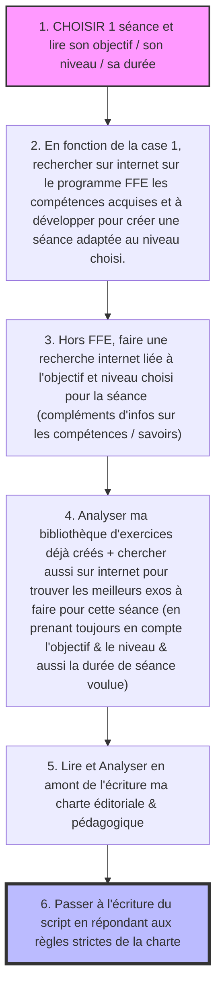

# 🧠 CHAÎNE DE RÉFLEXION : CRÉATION D'UN SCRIPT PARFAIT

Ce document retranscrit exactement ta méthode de travail manuscrite pour la création d'un script.

### 💡 Comment voir ce document en "bulles" ?
Si tu vois du texte avec des flèches `-->`, c'est que tu es en mode "édition". Pour voir le dessin :
1.  **Sur ton ordinateur** : Demande à ton mari d'ouvrir ce fichier avec **VS Code** et d'appuyer sur `Ctrl+Shift+V`. Le dessin apparaîtra instantanément.
2.  **Sur GitHub** : Une fois que tu auras fait le "push", va sur le site GitHub, clique sur le fichier, et il s'affichera automatiquement sous forme de schéma graphique.

### Transcription mot pour mot (pour vérification) :
J'ai bien noté tes 6 étapes :
*   **Étape 1** : Choix de la séance, objectif, niveau, durée.
*   **Étape 2** : Recherche FFE (compétences acquises/à développer).
*   **Étape 3** : Recherche Hors FFE (compléments d'infos).
*   **Étape 4** : Analyse de ta bibliothèque d'exos + Internet (en fonction de l'objectif/niveau/durée).
*   **Étape 5** : Lecture de la charte éditoriale & pédagogique **avant** d'écrire.
*   **Étape 6** : Écriture finale respectant les règles strictes.

Est-ce que cette transcription est fidèle à ce que tu as sur tes photos ?
